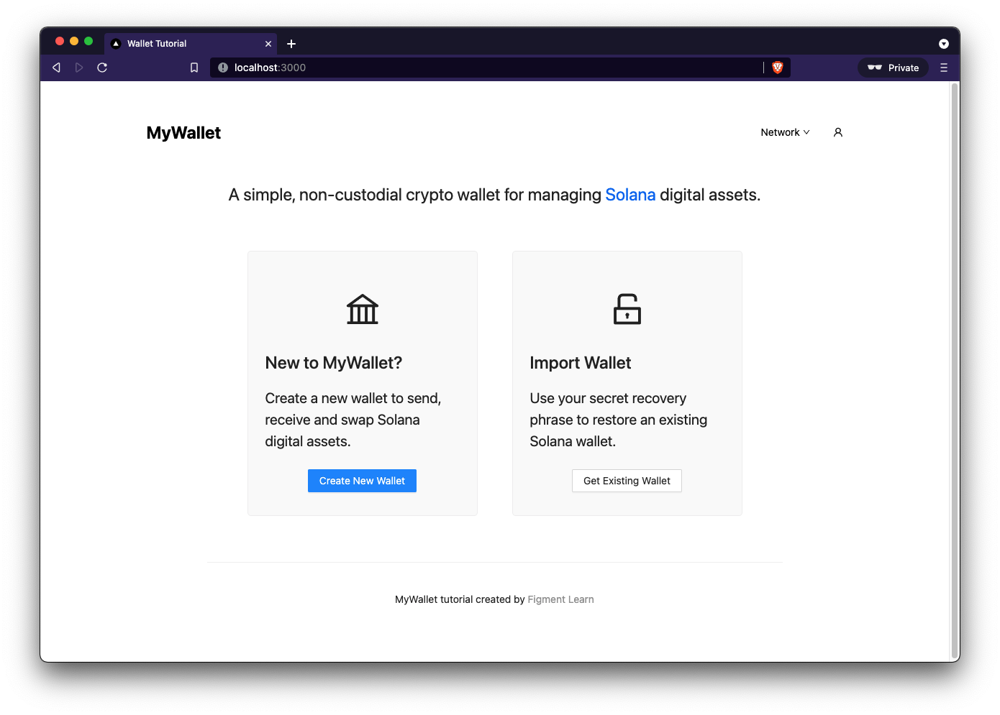

# Solana Wallet
Built using nextjs



## 🤔 What is the `wallet-dapp`?

Crypto wallets are one of the foundations of Web 3. They are the gateway application into crypto ecosystems by enabling users to interact with blockchain protocols and manage digital assets.

Under the hood, wallets leverage cryptographic technologies to generate and recover private keys - a concept that we'll define in the course of this tutorial. Those private keys give users access to public accounts that record ownership on a blockchain and expand the internet's functionality from a global network for information exchange to a global network for disintermediated economic exchange.


## 💻 Running the development server
Start the Next.js development server on the default port 3000 with:

```
yarn dev
```

> Alternatively, run `yarn dev -p 8080` or any port other than `8080` to start the server in a different port.

Once the server is running, you should see output that looks like this:

```
yarn run v1.22.11
$ next dev
ready - started server on 0.0.0.0:3000, url: http://localhost:3000
info  - Using webpack 5. Reason: Enabled by default https://nextjs.org/docs/messages/webpack5
event - compiled successfully
```

You can now view the running application at [http://localhost:3000](http://localhost:3000)

## 🔩 Designed by Figment Learn
Our goal at [Figment Learn](https://learn.figment.io/) is to build the best resources for developers learning about and building in Web 3. We really hope you enjoy the tutorial and thanks for checking it out. **WAGMI!**

Learn more about [Figment](https://figment.io/) and [Figment Learn](https://learn.figment.io/).

[Join us on Discord](https://discord.com/invite/fszyM7K) if you have any feedback or questions!

-- The Figment Learn Team
